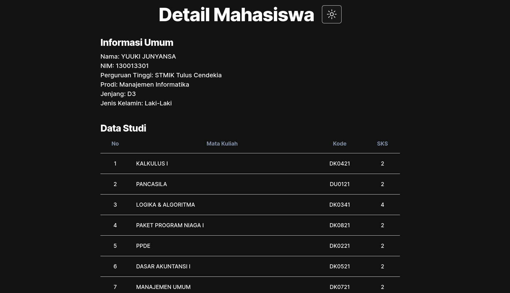

  <h1>Cari Mahasiswa</h1>
  
Cari Mahasiswa adalah sebuah Website untuk mencari data Mahasiswa dari berbagai perguruan tinggi di Indonesia

## Features

- Cari mahasiswa berdasarkan NIM, nama, jurusan, serta nama perguruan tinggi
- Tampilkan detail mahasiswa(seperti status kuliah, mata kuliah).

## Screenshots

## Tech Stack

- Next JS 13
- Typescript
- Tailwind CSS with shadcn/ui
- React Query
- Trpc
