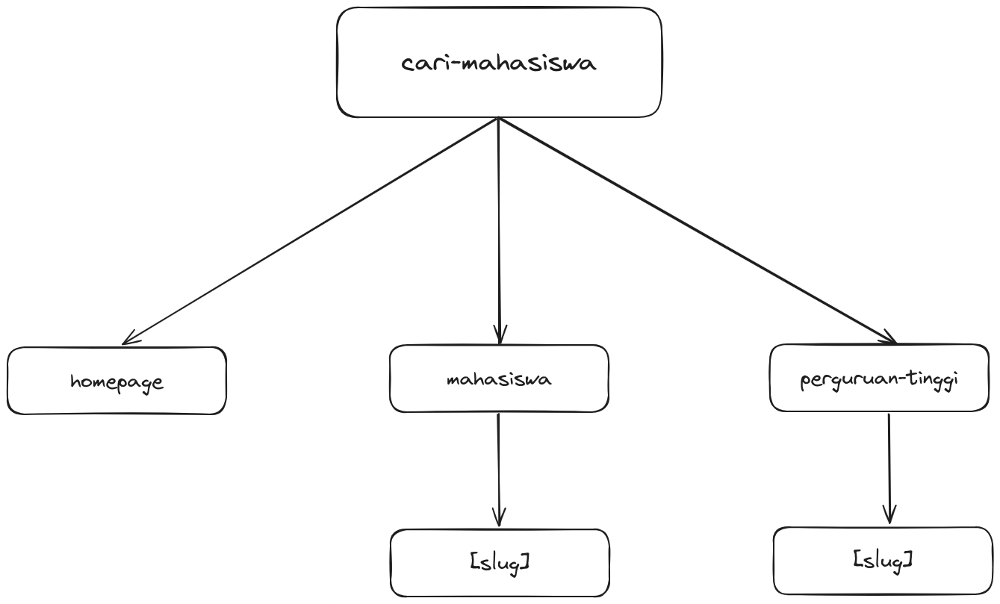
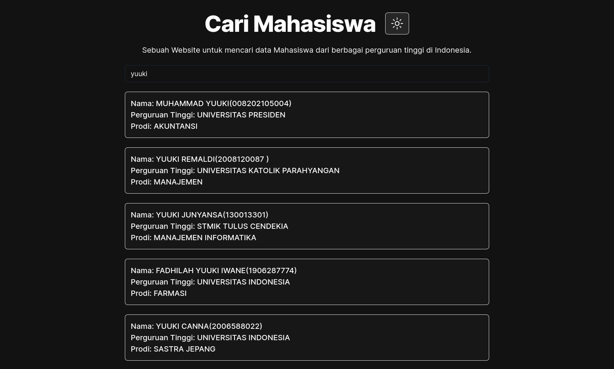

  <h1>Cari Mahasiswa</h1>
  
Cari Mahasiswa adalah sebuah Website untuk mencari data Mahasiswa dari berbagai perguruan tinggi di Indonesia

## Features

- Cari mahasiswa berdasarkan NIM, nama, jurusan, serta nama perguruan tinggi.
- Tampilkan detail mahasiswa.
- Tampilkan detail perguruan tinggi.
- Switch theme(dark, light, system).

## Website Structure

## Screenshots

**Note:** Data mahasiswa dan perguruan tinggi di atas hanya sebagai contoh.

## Videos

## Tech Stack

- Next JS
- Typescript
- Tailwind CSS with shadcn/ui
- React Query
- tRPC

## Getting Started

- Clone this repo.
- Install all needed deps with `pnpm install`.
- Fill all needed environment variable. You can see the format of my env in `.env.example` file.
- Type `pnpm run dev` and see the result in `http://localhost:3000`.

## License

[MIT](https://github.com/haikelz/money-management/blob/master/LICENSE)
